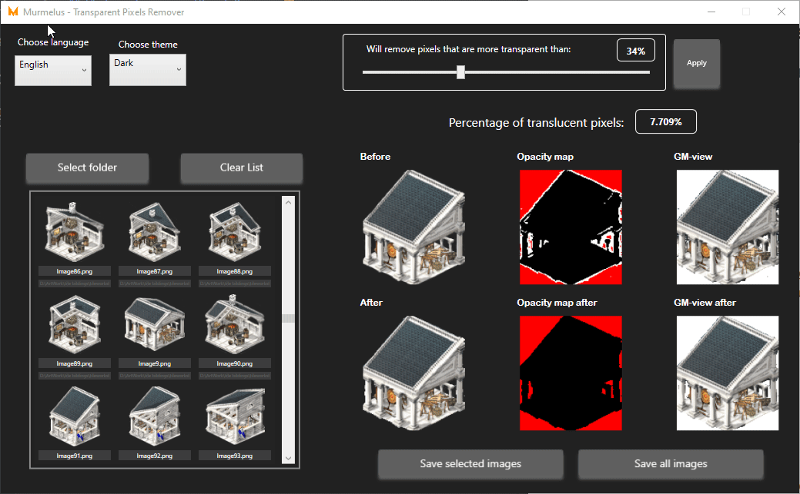
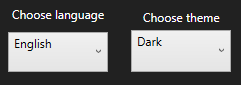
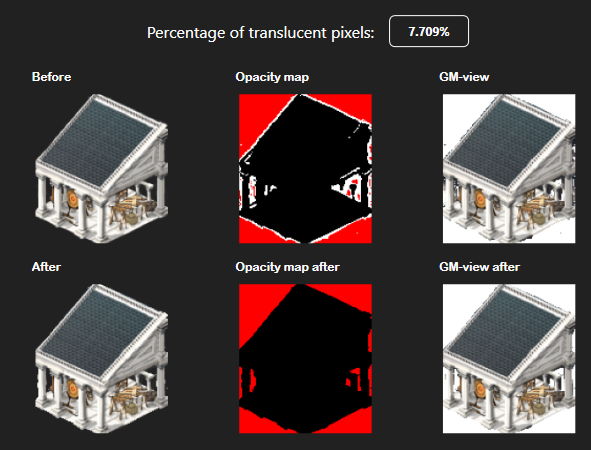

## What is TransparentPixelsRemover 😋
Transparent Pixels Remover is a simple handy application for removing translucent pixels from a large number of png files!

---

## How to use 🔨

Follow these steps to launch the application:

1. Clone this repository on your computer.
2. Run the application installation by running setup.exe from the setup folder.
3. Сhoose the appropriate theme and language.

4. Select folder with png images.

5. Select the threshold for removing translucent pixels.

6. Check results.

7. Choose saving option.

---
## Your gratitude 💕
Subscribe to my **YouTube** channel - **https://www.youtube.com/@murmelus**

---
## Questions? 💬
Write to **murmelusblog@gmail.com**, but the best thing can be a comment under my video 😎